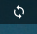
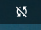
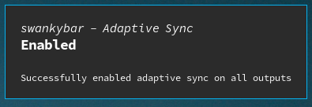

# swankybar

Sway + Waybar custom plugin to toggle Adaptive Sync from Waybar.

Made this custom plugin because Sway with adaptive sync on causes my monitors to flicker, so I only want to use it when gaming. But I can never remember the magical invocation and `swaymsg --help` is not very helpful.

  



Static-linked Haskell release binary lovingly built with Nix flakes! See `flake-static.nix`.

## Requirements

- Sway
- Waybar > v 0.9.5
- (Optional) DBus notifications through `org.freedesktop.Notifications`
- A font with the following Glyphs: 󰓦 󱆢 󰓨 󰓧

## Installation

 1. Download `swankybar-as`
 2. `chmod +x swankybar-as`
 3. Add this to your Waybar config (usually in `~/.config/waybar/config`)
 
 ```json
 "custom/swankybar-as" : {
   "format": "{}",
   "format-alt": "{}",
   "on-click": "PATH/TO/swankybar-as toggle", // UPDATE THIS
   "on-click-middle": "PATH/TO/swankybar-as toggle --all", // UPDATE THIS
   "on-click-right": "PATH/TO/swankybar-as", // UPDATE THIS
   "return-type": "json",
   "tooltip": true,
   "exec": "PATH/TO/swankybar-as", // UPDATE THIS
   "exec-on-event": true,
   "interval": 60 // Set this to whatever you like
 }
 ```
 
## Installation on NixOS

Add to a NixOS config with 
 ```nix
pkgs.haskellPackages.callPackage
 ```

For example, the v0.1.0.0 release in my config looks like this:

``` nix
let swankybar = pkgs.haskellPackages.callPackage (pkgs.fetchFromGitHub {
    owner = "vkraven";
    repo = "swankybar";
    rev = "16efddc0acc8e1c010e5a7fed6794b0a1d01f461";
    sha256 = "Xwp5r9j1Vu0W+x3bNAdTw0/wjmIAtuk6iBYgBhcSOJg=";
}) {};

...


environment.systemPackages = [

 ...
 
 swankybar
];

```

Or, in an overlay:

``` nix
self: super: 
{
  swankybar = super.haskellPackages.callPackage (super.fetchFromGitHub {
    owner = "vkraven";
    repo = "swankybar";
    rev = "16efddc0acc8e1c010e5a7fed6794b0a1d01f461";
    sha256 = "Xwp5r9j1Vu0W+x3bNAdTw0/wjmIAtuk6iBYgBhcSOJg=";
  }) {};
}
```
